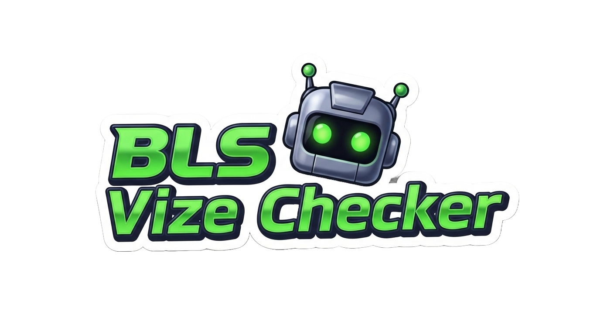

# 🤖 BLS Vize Randevu Bulucu

<p align="center">
  
</p>

BLS Turkey İspanya vize randevularını otomatik olarak takip eden ve uygun slot bulduğunda Telegram üzerinden haber veren bir otomasyon aracıdır.

## 🚀 Hızlı Başlangıç

### 1. Hazırlık
- Node.js yüklü olmalıdır.
- [BLS sitesinde](https://turkey.blsspainglobal.com/Global/Account/LogIn) hesabınız ve bir başvuru kaydınız olmalıdır.

```bash
npm install
```

> [!NOTE]
> Selenium 4+ ile ChromeDriver otomatik yönetilir, manuel kurulum gerekmez.

### 2. Yapılandırma
`.env.example` dosyasını `.env` olarak kopyalayıp doldurun:
```env
EMAIL=BLS_EMAIL
PASSWORD=BLS_PASSWORD

# Telegram Bildirimleri
TELEGRAM_BOT_TOKEN=bot_token
TELEGRAM_CHAT_ID=chat_id
```

Taranacak şehirleri `config.js` dosyasındaki `CITIES` dizisinden ayarlayın:
```js
CITIES: [
  { name: 'Ankara', JURISDICTION: 'Ankara', LOCATION: 'Ankara' },
  { name: 'Istanbul', JURISDICTION: 'Istanbul', LOCATION: 'Istanbul' },
]
```

### 3. Çalıştır
```bash
npm start
```

## 🎯 Temel Özellikler
- **Çoklu Şehir:** Ankara, İstanbul ve diğer ofisleri sırayla tarar.
- **Akıllı Sıralama:** Son taranan şehri hatırlar, bir sonraki oturumda gereksiz adımları atlayarak kaldığı yerden devam eder.
- **7/24 Takip:** Özelleştirilebilir aralıklarla çalışır (sabah 20 dk, öğleden sonra 120 dk).
- **Captcha Çözümü:** OCR desteği ile captcha'ları otomatik aşar.
- **Geniş Tarama:** 12 ay ileriye kadar tüm uygun tarihleri kontrol eder.
- **Anlık Bildirim:** Randevu bulunduğunda Telegram üzerinden bildirim gönderir.
- **Normal + Premium:** Her şehir için her iki kategori de kontrol edilir.

## 🔧 Teknik Yapı
- **Selenium WebDriver:** Tarayıcı otomasyonu
- **Tesseract.js:** OCR ile captcha çözümü
- **Node.js:** Ana çalışma ortamı

## ⚠️ Önemli Notlar
- **Güvenlik:** `.env` dosyanızı kimseyle paylaşmayın.
- **Hız:** Slot bildirimi gelir gelmez işlem yapın, hızla dolabilir.
- **Kapsam:** Schengen (Kısa Süreli) başvuruları için optimize edilmiştir.

## ⚖️ Sorumluluk Reddi
Bu proje Ar-Ge ve eğitim amaçlıdır. Kullanımdan doğacak sonuçlardan geliştirici sorumlu tutulamaz.

## 📄 Lisans
[MIT](LICENSE)
